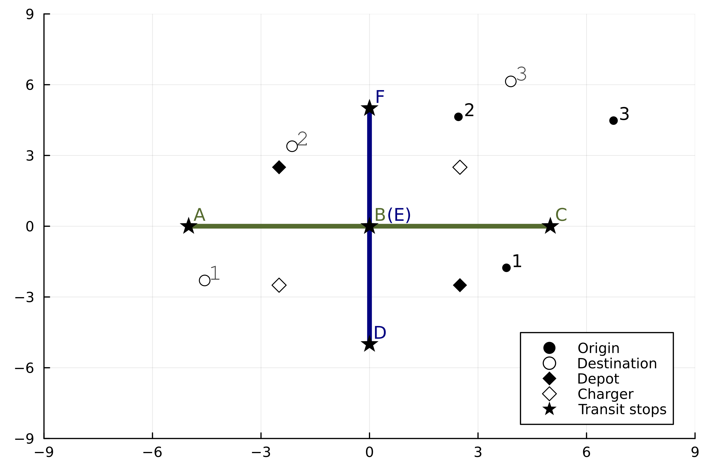
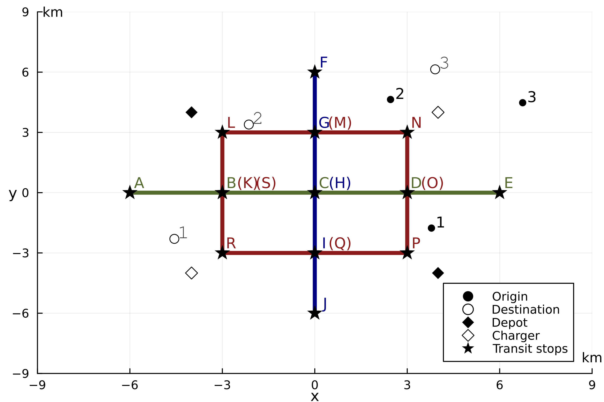

# Instances for the integrated electric dial-a-ride problem (EIDARP)

## Layout of transit network
Each layout has its own foolder. There are two folders, which are [cross]("/cross")(two transit lines) and [corss-ring]("/cross-ring")(three transit lines) layouts of transit. Each folder has a 'layout-network.csv' file indicating transit station coordinates and their tranfer station(s). The two layouts are shown in the figures below. 

Cross network:

Cross-Ring network:

Both layouts have 8 instances that each also has a dedicated folder. The name of instance folders have the structure of, e.g. *l2-c6-d2-bt2*, where:
- *l*: number of transit lines
- *c*: number of customers
- *d*: number of depots, currently there is one used
- *bt*: number of bus types

## Files inside each instance
Every instance folder contains the following files. The files are self-explainary.
- *buses.csv*
- *chargers.csv*
- *customers.csv*
- *depots.csv*
- *trainStops.csv*
- *timetable_linex.csv* where *x* is the line No.
- *other_parameters.csv*
